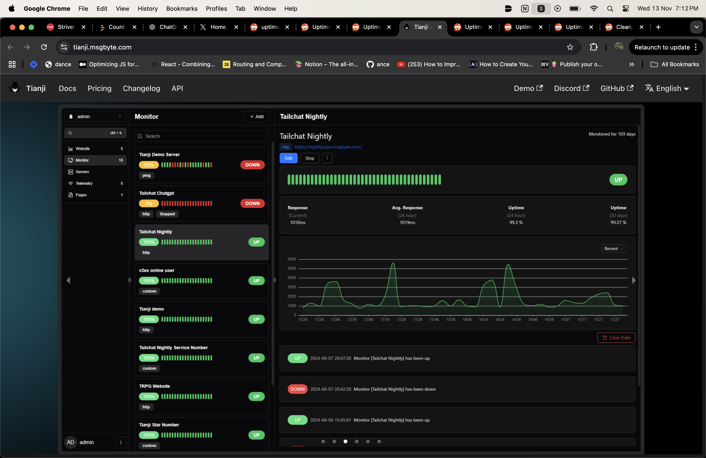

# Watchman

**Watchman** is a monitoring tool that checks the availability and status of specified websites/services. It logs the status, availability and latency.
## Features

- Monitors the uptime and status of a website at specified intervals.
- Sends email alerts when the monitored website goes down or encounters errors.
- Logs detailed information about website status and monitoring times.
- Customizable monitoring frequency and notification settings.

Goal
